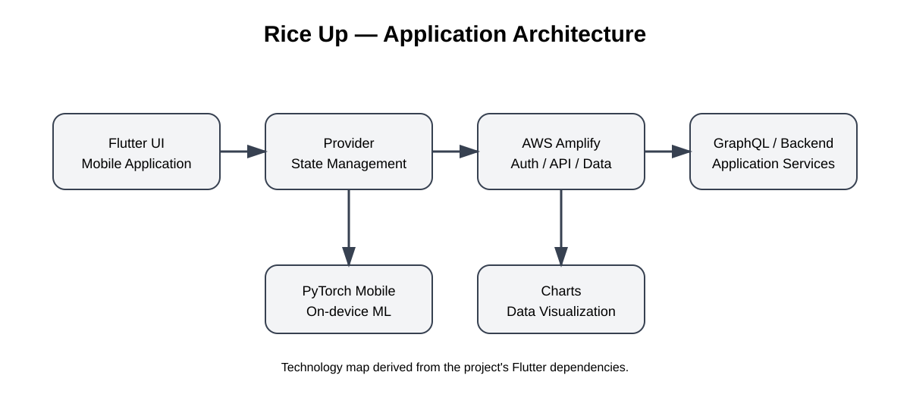

# Rice Up

A Flutter mobile application that combines a mobile interface with cloud services, data access, visualization, and machine-learning capabilities.


## What is Rice Up?

Rice Up is a Flutter application built to bring several parts of a modern mobile solution together. The application uses Flutter and Dart for the client side, while AWS Amplify, Cognito, GraphQL, and DataStore provide the cloud and data layer.

The project also includes charting, network connectivity handling, image selection, and PyTorch Mobile support.

Rather than focusing on one technology, the project is useful as an example of how an application can connect the user interface, application state, backend services, data, and machine learning.

## Architecture



The diagram shows the main building blocks and how they relate to each other.

## Technology stack

| Area | Technology | Purpose |
|---|---|---|
| Mobile | Flutter / Dart | Build the application |
| State management | Provider | Manage shared application state |
| Authentication | AWS Amplify / Cognito | Handle user identity and authentication |
| API | GraphQL | Communicate with backend services |
| Data | Amplify DataStore | Store and synchronize application data |
| Machine learning | PyTorch Mobile | Support on-device inference |
| Visualization | Syncfusion Charts | Display data in charts |
| Connectivity | connectivity_plus | Detect network changes |
| Images | image_picker | Select images from the device |

The technologies above are based on the dependencies defined by the project. fileciteturn9file0

## What this project demonstrates

This project gave me practical experience with several areas that normally have to work together in a real application:

- Building a cross-platform application with Flutter
- Managing application state with Provider
- Integrating AWS services into a mobile application
- Working with GraphQL APIs
- Handling application data and synchronization
- Displaying data through interactive charts
- Handling network connectivity
- Integrating machine-learning functionality into a mobile application

## Getting started

### Requirements

- Flutter SDK
- A compatible Dart SDK
- Android Studio or Xcode
- An Android/iOS emulator or physical device
- The required AWS Amplify configuration for cloud features

### Installation

```bash
git clone https://github.com/FadyElhosary/Rice_Up.git
cd Rice_Up
flutter pub get
flutter run
```

Some cloud functionality depends on the original AWS Amplify/Cognito environment. If you want to reproduce the complete application, you may need to configure those services for your own environment.

Do not commit credentials, API keys, or other secrets to the repository.

## Project structure

The `docs` directory contains the architecture diagram used in this README. It is there to make the project easier to understand before going through the implementation.

## Notes

This repository represents a practical application project and not a production-ready template. Some integrations were created for the original development environment, so additional configuration may be required when running the project today.

## Author

**Fady Elhosary**  
Data Engineer

[LinkedIn](https://www.linkedin.com/in/fady-elhosary-68064a338/) · fadymohamed1@gmail.com
